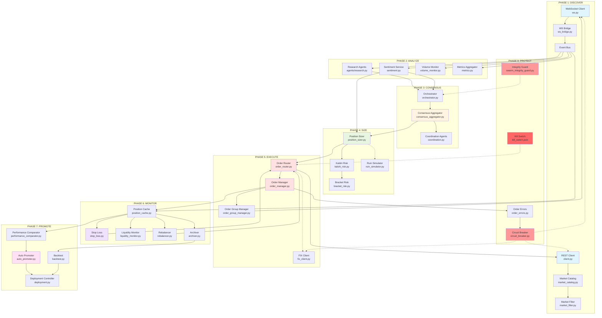
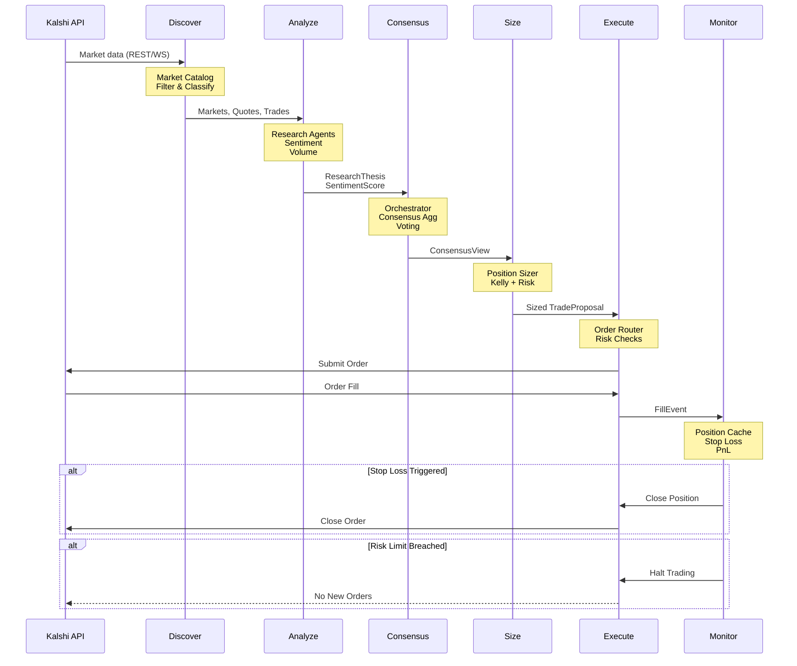

# KALSHI INTEGRATION - DEPENDENCY GRAPH & DATA FLOW

**Generated**: 2026-03-25
**Purpose**: Visual representation of component dependencies and data flow across all 8 phases

---

## PHASE DEPENDENCY GRAPH



---

## CRITICAL PATH SEQUENCE DIAGRAM



---

## COMPONENT INTERACTION MATRIX

| Component | Reads From | Writes To | Dependencies | Criticality |
|-----------|------------|-----------|--------------|-------------|
| **REST Client** | Kalshi API | Market Catalog, Event Bus | rate_limit_coordinator, circuit_breaker | CRITICAL |
| **WebSocket** | Kalshi WS | Event Bus, Position Cache | circuit_breaker | CRITICAL |
| **Market Catalog** | REST Client | Market Filter, Research Agents | None | HIGH |
| **Research Agents** | Event Bus, Catalog | Orchestrator | LLM APIs (optional) | MEDIUM |
| **Sentiment Service** | Event Bus | Orchestrator, Position Sizer | None | MEDIUM |
| **Consensus Aggregator** | Orchestrator | Position Sizer | None | HIGH |
| **Position Sizer** | Consensus, Sentiment | Order Router | Kalshi Risk | CRITICAL |
| **Order Router** | Position Sizer | Order Manager, Clients | Kill Switch, Risk Manager | CRITICAL |
| **Order Manager** | Order Router | Position Cache, Event Bus | WebSocket | CRITICAL |
| **Position Cache** | Order Manager, WS | Stop Loss, Monitors | None | CRITICAL |
| **Stop Loss** | Position Cache | Order Router | None | HIGH |
| **Auto Promoter** | Position Cache, Metrics | Deployment Controller | None | MEDIUM |
| **Integrity Guard** | All Components | Orchestrator (veto) | Policy File | HIGH |
| **Circuit Breaker** | Clients (errors) | All Clients | Redis (shared state) | CRITICAL |
| **Kill Switch** | File System | Order Router | None | CRITICAL |

---

## DATA FLOW BY MESSAGE TYPE

### Price Update Flow
```
Kalshi WS → WebSocket Client → WS Bridge → Event Bus → [Sentiment, Volume Monitor, Research Agents]
```

### Trade Execution Flow
```
Consensus → Position Sizer → Order Router → REST/FIX Client → Kalshi API
                                                  ↓
                                           Order Manager → Position Cache
```

### Order Fill Flow
```
Kalshi API → WebSocket Client → WS Bridge → Event Bus → Order Manager
                                                              ↓
                                                      Position Cache → [PnL, Stop Loss, Promoter]
```

### Stop Loss Trigger Flow
```
Position Cache → Stop Loss Rules → Order Router → REST Client → Kalshi API
```

### Risk Veto Flow
```
Consensus → Risk Manager Agent → [Veto Decision] → Orchestrator → (No Trade)
```

---

## FAILURE MODES & CASCADES

### Scenario 1: REST API Outage
```
REST Client fails → Circuit Breaker opens → Catalog refresh fails → Agents use stale data
                                          → Order Router falls back to WS → Trading continues (degraded)
```

### Scenario 2: WebSocket Disconnect
```
WebSocket disconnects → Reconnect with backoff → Position Cache stale → Stop Loss polling fallback
                                                                      → Order fills tracked via REST
```

### Scenario 3: Consensus Timeout
```
Agent hangs → Consensus timeout (10s) → STALE status → size_band=halted → No new trades
                                                                        → Alert fires
```

### Scenario 4: Kill Switch Activation
```
Manual trigger → kill_switch.json → Order Router checks → All new orders rejected
                                                        → Open positions monitored but not closed
```

### Scenario 5: Daily Loss Cap Hit
```
Position loss → Risk Manager tracks → Pre-trade check → Order rejected → Trading halted
                                                                      → Alert fires
```

---

## LATENCY BUDGET BREAKDOWN

| Phase | Target P95 | Current Est. | Budget Allocation | Critical Path |
|-------|-----------|--------------|-------------------|---------------|
| **1. Discover** | 100 ms | 150 ms | 9% | Market Catalog refresh |
| **2. Analyze** | 500 ms | 2000 ms | 43% | LLM inference (slow) |
| **3. Consensus** | 200 ms | ∞ | 17% | Agent voting |
| **4. Size** | 50 ms | 80 ms | 4% | Kelly calculation |
| **5. Execute** | 200 ms | 300 ms | 17% | API round-trip |
| **6. Monitor** | 100 ms | 150 ms | 9% | Stop loss check |
| **7. Promote** | N/A | N/A | 0% | Background task |
| **8. Protect** | 10 ms | 20 ms | 1% | Pre-trade checks |
| **TOTAL** | **1150 ms** | **2680 ms** | **100%** | End-to-end cycle |

**Bottleneck Analysis**:
- **Analyze Phase (43%)**: LLM inference is slowest. Need timeout + caching.
- **Consensus Phase (17%)**: No timeout enforcement. Need hard 10s limit.
- **Execute Phase (17%)**: API latency variable. Need latency prediction.

---

## TELEMETRY & OBSERVABILITY HOOKS

### Critical Metrics (P0)

| Metric | Source | Alert Threshold | Action |
|--------|--------|-----------------|--------|
| `rate_limit_utilization` | rate_limit_coordinator | >80% for >30s | Throttle subscriptions |
| `consensus_duration_ms` | consensus_aggregator | >10000ms | Timeout & fallback |
| `ws_queue_fullness_pct` | ws.py | >90% | Prioritize messages |
| `order_deduplication_rate` | order_cache | >10% | Investigate retries |
| `pnl_reconciliation_delta` | PnL tracker | >$10 or >1% | Manual review |
| `session_loss_pct` | risk_manager | >75% of cap | Warning alert |
| `session_loss_pct` | risk_manager | >95% of cap | Halt trading |
| `circuit_breaker_state` | circuit_breaker | open | Fallback mode |
| `kill_switch_active` | kill_switch | true | All trading halted |

### Secondary Metrics (P1)

| Metric | Source | Dashboard | Purpose |
|--------|--------|-----------|---------|
| `discovery_latency_ms` | market_catalog | Discovery | Track API performance |
| `sentiment_staleness_ms` | sentiment_service | Analyze | Data freshness |
| `agent_timeout_count` | orchestrator | Consensus | Agent reliability |
| `position_sizing_adjustments` | position_sizer | Size | Volatility impact |
| `order_submission_latency_ms` | order_router | Execute | Execution quality |
| `stop_loss_trigger_count` | stop_loss | Monitor | Risk effectiveness |
| `promotion_gate_pass_rate` | auto_promoter | Promote | Agent readiness |
| `integrity_check_failures` | integrity_guard | Protect | System health |

---

## DISASTER RECOVERY PROCEDURES

### 1. Circuit Breaker Open (API Failures)
**Detection**: 5 consecutive API failures
**Response**:
1. Circuit opens automatically (30s timeout)
2. Alert sent to oncall
3. System uses last known good data
4. Trades queue (do not execute)
5. Manual investigation required

**Recovery**:
1. Verify API is operational
2. Circuit auto-closes after timeout
3. Resume trading with backlog
4. Monitor error rate for 1h

---

### 2. Consensus Deadlock
**Detection**: Consensus duration >10s
**Response**:
1. Timeout triggers automatically
2. Return STALE consensus with halted size_band
3. Alert sent to oncall
4. Investigate hung agent

**Recovery**:
1. Identify slow/hung agent
2. Restart agent or disable
3. Verify consensus resumes
4. Monitor latency for 1h

---

### 3. Daily Loss Cap Hit
**Detection**: Session loss >95% of cap
**Response**:
1. Pre-trade checks reject all orders
2. Alert sent to oncall + Telegram
3. Existing positions monitored
4. No new trades until reset

**Recovery**:
1. Manual review of losses
2. Investigate root cause
3. Adjust loss cap if needed
4. Reset session (next day or manual)

---

### 4. Kill Switch Activation
**Detection**: kill_switch.json active=true
**Response**:
1. All new orders rejected
2. Existing positions monitored
3. Stop losses still active
4. Alert sent to oncall

**Recovery**:
1. Verify emergency is resolved
2. Manually set active=false
3. Restart order router
4. Resume trading with caution

---

### 5. PnL Reconciliation Failure
**Detection**: Internal PnL ≠ Kalshi API (>$10 or >1%)
**Response**:
1. Halt new trades
2. Alert sent to oncall
3. Manual reconciliation required
4. Investigate missing fills

**Recovery**:
1. Compare internal fills vs API trades
2. Identify discrepancies
3. Adjust internal state
4. Resume trading after validation

---

## APPENDIX: KEY FILE LOCATIONS

### Configuration
- `/home/runner/work/MERID/MERID/.kalshi/category_config.json` - Per-category trading modes
- `/home/runner/work/MERID/MERID/data/kill_switch.json` - Emergency stop
- `/home/runner/work/MERID/MERID/.merid_safeguard.yml` - Integrity policy

### Runtime State
- `/home/runner/work/MERID/MERID/data/paper_positions.json` - Paper positions
- `/home/runner/work/MERID/MERID/data/paper_session_state.json` - Session metrics
- `/home/runner/work/MERID/MERID/data/promotion_log.json` - Promotion history
- `/home/runner/work/MERID/MERID/data/reconciliation_report.json` - PnL reconciliation

### Logs
- `logs/merid.log` - Main application log
- `logs/audit.log` - Audit trail (all trades, fills, stops)
- `logs/kalshi_rest.log` - REST API calls
- `logs/kalshi_ws.log` - WebSocket messages
- `logs/consensus.log` - Consensus formation

---

**END OF DEPENDENCY GRAPH DOCUMENTATION**
